## 📘 Description
This phase documents the deployment of core Azure infrastructure components, including a resource group, virtual network, and virtual machines (DC01 and Client01). This sets the foundation for building an on-premises-style Active Directory environment in the cloud.

---

## 🧰 Tools and Technologies Used
- **Cloud Provider:** Microsoft Azure
- **Services:** Azure Virtual Machines, Resource Groups, Virtual Networks, Network Interfaces
- **Utilities:** Azure Portal

---

## 🌐 Environment Overview
- **Resource Group:** `LognPacificLab-RG`
- **Virtual Network:** `LognPacific-VNet`
- **Subnets:** One default subnet (for both VMs)
- **Virtual Machines:**
  - `DC01`: Windows Server 2022 (to be configured as Domain Controller)
  - `Client01`: Windows 10/11 (Domain-joined workstation)

---

## 🚀 Implementation Steps
### 1. Create Resource Group
- Name: `LognPacificLab-RG`
- Region: e.g., [Europe] UK West

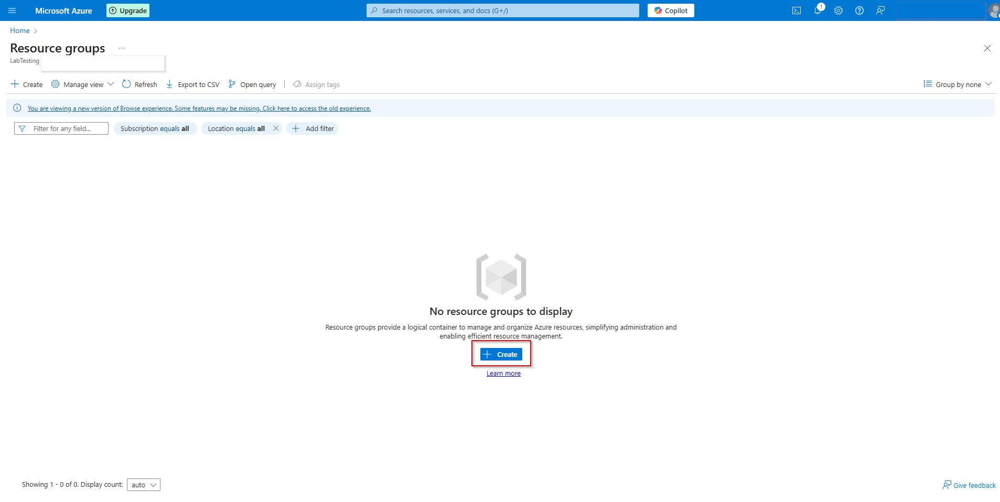
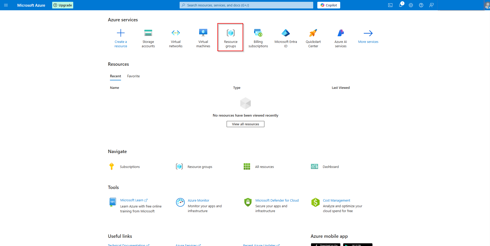
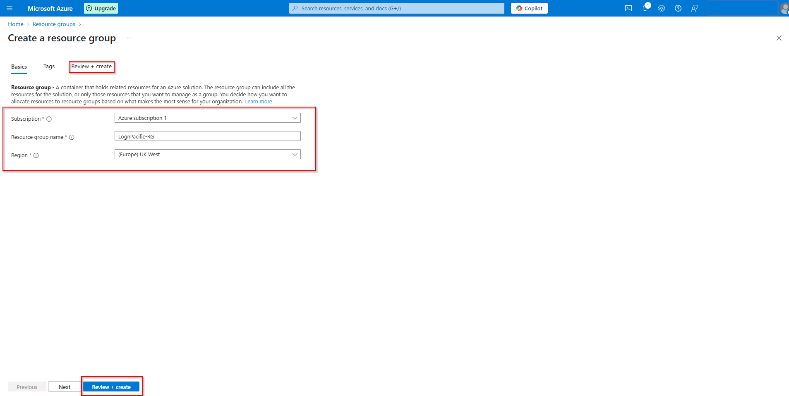
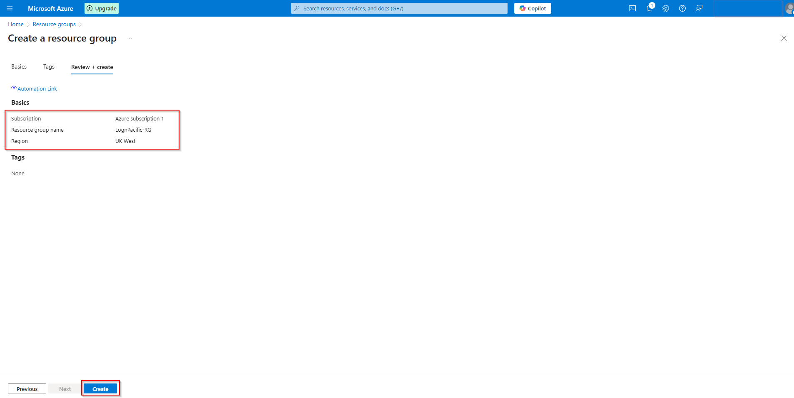

### 2. Create Virtual Network
- Name: `LognPacific-VNet`
- Subnet Name: `default` (or custom if needed)
- Address space: e.g., `10.0.0.0/16`

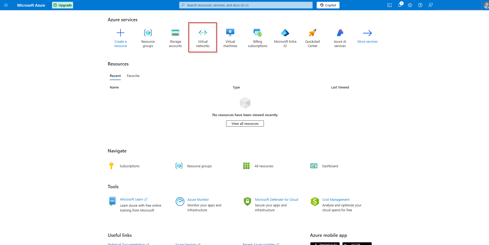
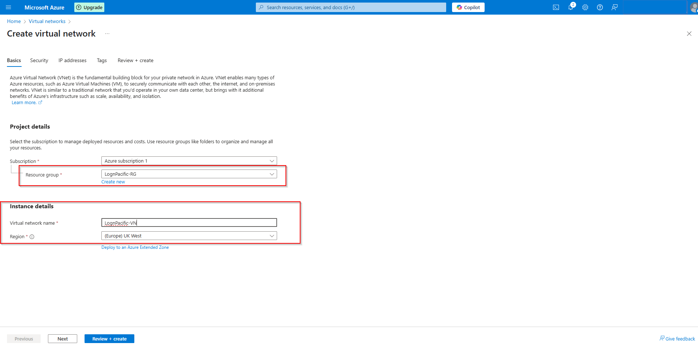
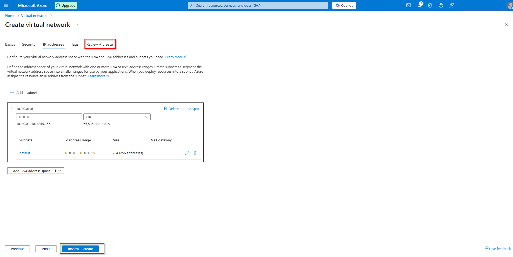
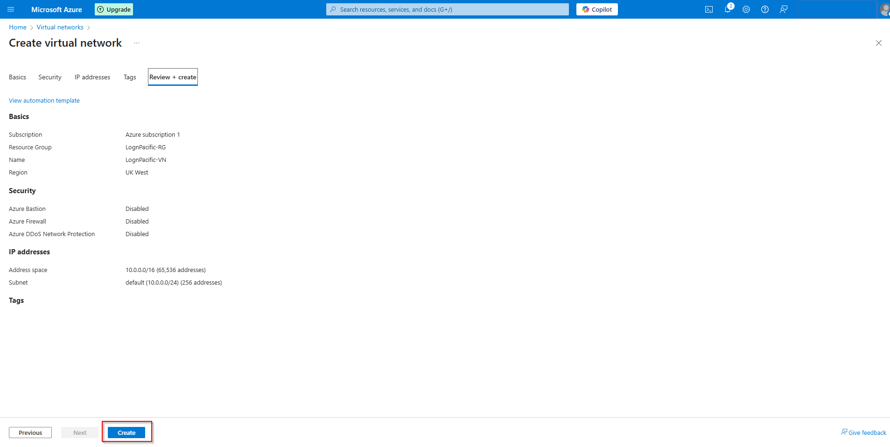

### 3. Create Virtual Machines
#### DC01 (Domain Controller)
- OS: Windows Server 2022
- NIC: Assign to `LognPacific-VNet`
- Inbound port: RDP (3389)
- Private IP: Make static

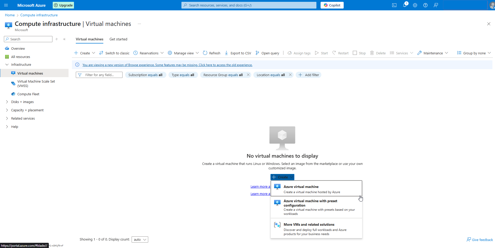
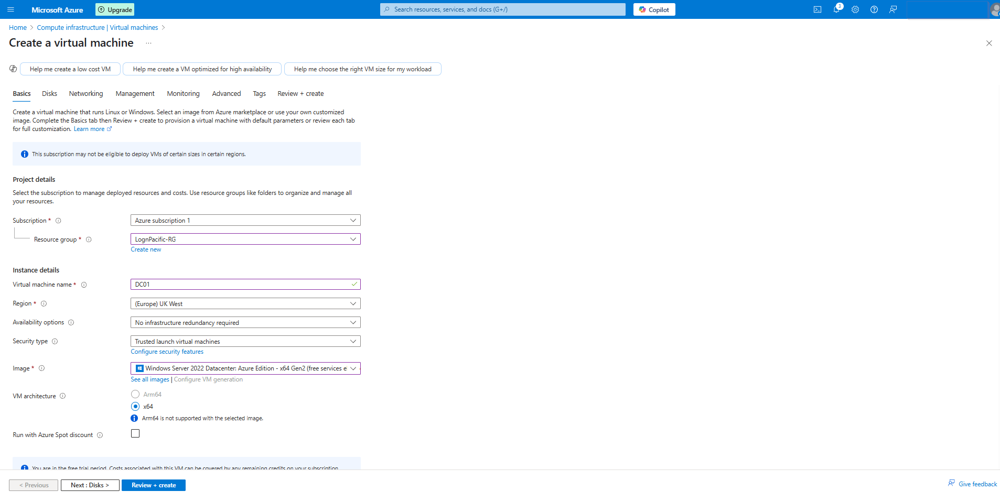
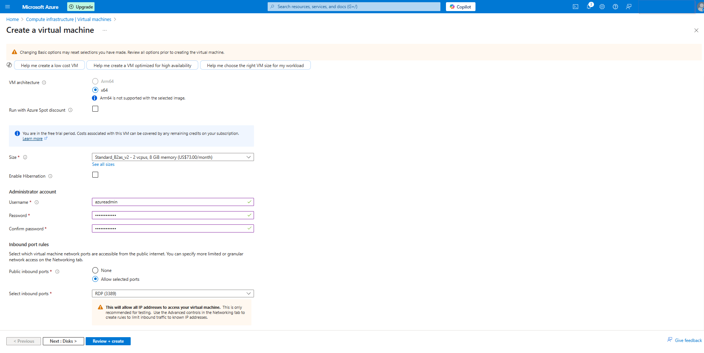
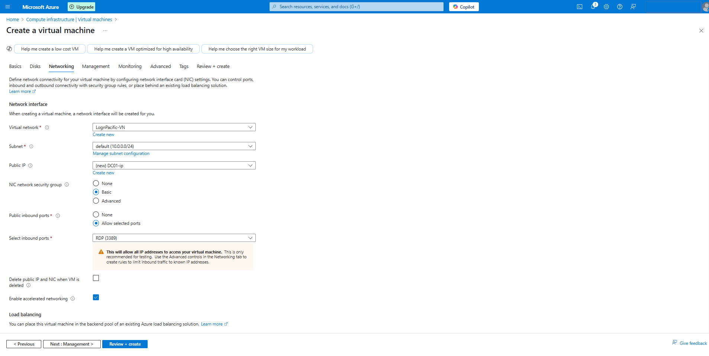
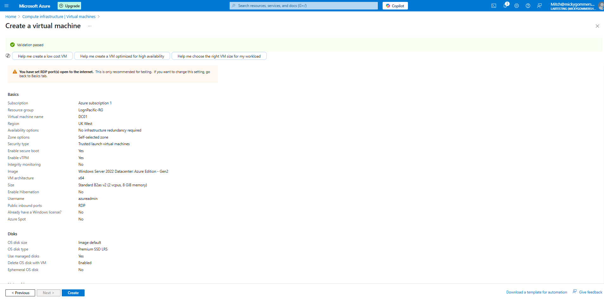
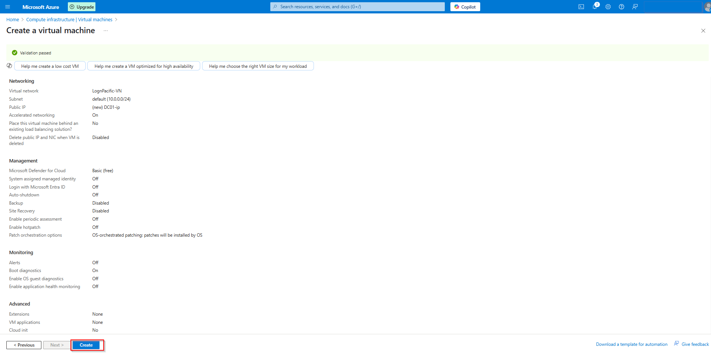

#### Client01 (Workstation)
- OS: Windows 10/11
- NIC: Assign to same VNet and subnet
- Inbound port: RDP (3389)

#### Repeat the same steps for Client01 (Workstation) but with Windows 10 as OS

---

## 📌 Notes & Considerations
- Ensure both VMs are deployed to the same virtual network for connectivity.
- After deployment, RDP into `DC01` and begin domain setup (next step).