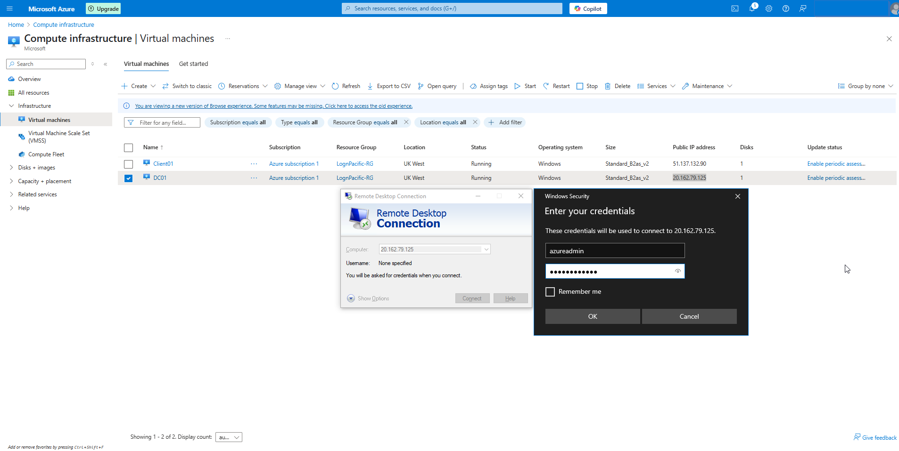

## 📘 Description
This section describes promoting `DC01` to a domain controller and configuring the foundational Active Directory Domain Services environment.

---

## 🧰 Tools and Technologies Used
- **OS:** Windows Server 2022
- **Role:** Active Directory Domain Services (AD DS)
- **Utilities:** Server Manager, PowerShell

---

## 🌐 Environment Overview
- **Server:** `DC01`
- **Domain:** `lognpacific.local`

---

## 🚀 Implementation Steps
### 1. Install AD DS Role on DC01
- Open Server Manager > Add Roles and Features > Select AD DS

### 2. Promote DC01 to Domain Controller
- After installation, click "Promote this server to a domain controller"
- Select "Add a new forest": `lognpacific.local`
- Set DSRM password
- Accept defaults, review, and complete installation

---

## 3. Installing Active Directory Certificate Services (AD CS)

To simulate a production environment where secure services (like RDP, file shares, or web applications) use certificates, we installed **Active Directory Certificate Services** on the domain controller.

### 🔹 Role: Certification Authority

We selected the following during the wizard:
- **Role Services**: Certification Authority
- **Setup Type**: Enterprise CA
- **CA Type**: Root CA
- **Private Key**: New private key
- **Cryptography**: RSA 2048-bit (default)
- **CA Name**: DC01-CA
- **Validity Period**: Default
- **Database Paths**: Default

> This configuration allows the Domain Controller to issue and manage certificates for internal use, such as secure LDAP and internal HTTPS.

Configuration
-

---

### 4. Set Static IP and DNS
- Set private IP of DC01 to static (from Azure networking settings)
- Set DNS of Client01 to localhost (`127.0.0.1`) or its static IP (e.g., `10.0.0.4`)

DNS - Client01
-

